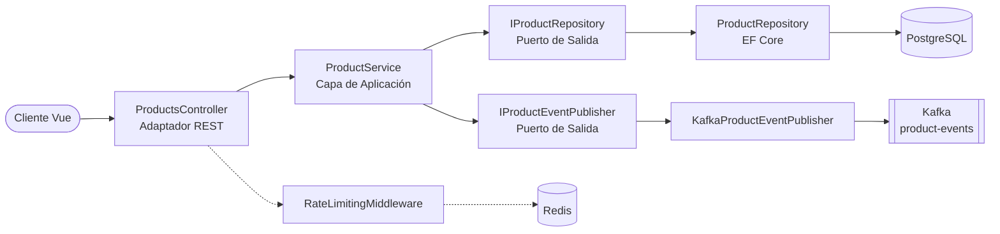

[](https://github.com/apchavez/net-vue/actions/workflows/ci.yml)
[](https://sonarcloud.io/summary/new_code?id=apchavez_net-vue)
[](https://sonarcloud.io/summary/new_code?id=apchavez_net-vue)

# .NET + Vue Fullstack K8s

Monorepo fullstack de gestión de productos: backend **ASP.NET Core Web API** siguiendo Clean/Hexagonal Architecture, frontend **Vue 3** (Composition API, Vuetify), eventos de dominio con Kafka, rate limiting y caché de lectura respaldados por Redis, persistencia en PostgreSQL, cluster EKS provisionado con Terraform, y despliegue en Kubernetes basado en Helm con observabilidad Prometheus/Grafana.

Este repo es el **cuarto hermano** del dominio de Gestión de Productos, junto a [quarkus-react](https://github.com/apchavez/quarkus-react), [spring-webflux-angular](https://github.com/apchavez/spring-webflux-angular) y [spring-mvc-angular](https://github.com/apchavez/spring-mvc-angular) — mismo dominio de negocio (`sku`/`name`/`description`/`category`/`price`/`stock`/`active`), mismos 8 endpoints REST, mismo topic de Kafka `product-events` y mismos tipos de evento, mismas reglas de rate limiting en Redis (ventana fija de 100 req/60s en endpoints de escritura, 429 + `Retry-After`), mismo comportamiento de caché cache-aside en Redis sobre el listado de productos activos (TTL de 5 min, fail-open), distinto stack de backend/frontend.

---

## Estructura

```
├── api/        Backend ASP.NET Core (C# / .NET 9, Clean/Hexagonal Architecture) — ver api/README.md
├── web/        Frontend Vue 3 (Composition API, Vuetify) — ver web/README.md
├── chart/      Helm chart — los manifiestos que realmente se despliegan (deploy.yml)
├── terraform/  Cluster EKS + VPC sobre el que se despliega el chart anterior
├── postman/    Colección de Postman + entornos (local, k8s)
├── k6/         Script de pruebas de carga (k6.yml)
├── docker/     Config de scraping de Prometheus, provisioning de Grafana
└── docker-compose.yml
```

Ver [`api/README.md`](api/README.md) para el detalle completo de endpoints, seguridad y pruebas del backend, y [`web/README.md`](web/README.md) para el frontend.

---

## Stack Tecnológico

| Capa | Tecnología |
|---|---|
| Backend | C# / .NET 9, ASP.NET Core Web API, Clean/Hexagonal Architecture |
| Persistencia | PostgreSQL (EF Core / Npgsql) |
| Mensajería | Apache Kafka (Confluent.Kafka), topic `product-events` |
| Caché / Rate limiting | Redis (StackExchange.Redis) — cache-aside para el listado de productos activos (TTL 5 min, fail-open) + script Lua de ventana fija hecho a mano para el rate limiting |
| Autenticación | JWT RS256 (ASP.NET Core JwtBearer), almacén de credenciales de demo |
| Frontend | Vue 3 (Composition API), Vuetify, Pinia, Vue Router, Axios |
| Infraestructura | Terraform (EKS + VPC), Helm, Docker, GitHub Actions |
| Observabilidad | prometheus-net, dashboard de Grafana, alertas vía PrometheusRule |
| Testing | xUnit + Moq (unitarios de backend), Testcontainers + WebApplicationFactory (integración de backend), Vitest + Vue Test Utils (unitarios de frontend), Playwright (e2e) |

---

## Arquitectura



```
api/src
├── ProductApi.Domain          Entidad Product, excepciones de dominio, eventos, puertos
├── ProductApi.Application     ProductService (reglas de negocio + publicación de eventos)
├── ProductApi.Infrastructure  Repo EF Core/Postgres, publicador Kafka, rate limiter Redis, JWT/auth
└── ProductApi.Api             Controllers, DTOs, middleware, composition root en Program.cs
```

---

## API

Ver [`api/README.md`](api/README.md) para la tabla completa de endpoints, health checks (`/health`, `/health/live`, `/health/ready`), eventos de dominio, caché, rate limiting y seguridad. Resumen: ruta base `/api/v1/products`, JWT Bearer en todo salvo login/health/metrics, mismo topic Kafka `product-events` y mismas reglas de rate limiting (100 req/60s) que los 3 hermanos.

---

## Desarrollo Local

```bash
docker compose up -d          # Postgres, Redis, Kafka, Prometheus, Grafana
cd api
dotnet user-secrets set "ConnectionStrings:Postgres" "Host=localhost;Port=5432;Database=productdb;Username=product_user;Password=product_pass" --project src/ProductApi.Api  # una sola vez, coincide con la contraseña por defecto de Postgres en docker-compose
dotnet run --project src/ProductApi.Api
cd web && npm install && npm run dev
```

`appsettings.json`'s `ConnectionStrings:Postgres` deliberadamente no tiene un segmento `Password` — .NET User Secrets (ya configurado vía `UserSecretsId` en el `.csproj`, activo siempre que `ASPNETCORE_ENVIRONMENT=Development`) provee localmente el connection string completo en su lugar, de modo que ninguna credencial de ningún tipo vive en el código fuente. El propio servicio `api` de `docker compose up` no se ve afectado de ninguna forma — ya obtiene su connection string desde la variable de entorno `ConnectionStrings__Postgres` en `docker-compose.yml`, que siempre tiene prioridad sobre los valores del archivo de configuración.

La clave de firma JWT no está commiteada en el repo. Al arrancar, la API genera en memoria un par de claves RSA-2048 efímero si `Jwt__PrivateKeyPem`/`Jwt__PrivateKeyPath` no están configurados — funciona bien para desarrollo local/tests/CI (un solo proceso firma y verifica con la misma clave), pero **no es seguro para un despliegue real con múltiples réplicas**, ya que cada pod generaría su propia clave aleatoria y rechazaría los tokens emitidos por cualquier otro pod. Para un despliegue Helm real, genera un par de claves una sola vez y pásalo mediante `secrets.jwtPrivateKeyPem` — el chart lo conecta a `product-api-secret` como `Jwt__PrivateKeyPem`, compartido por todas las réplicas:

```bash
openssl genrsa -out privateKey.pem 2048
helm upgrade --install product-api ./chart --set-file secrets.jwtPrivateKeyPem=privateKey.pem
```

## Testing

```bash
cd api
dotnet test tests/ProductApi.UnitTests          # 49 tests
dotnet test tests/ProductApi.IntegrationTests   # 19 tests, respaldados por Testcontainers con Postgres

cd web
npm run test        # 8 tests unitarios con Vitest
npm run test:e2e     # 5 tests E2E con Playwright
```

**81 tests en total** (68 backend + 13 frontend, conteo real de `[Fact]`/`[Theory]`/`it(`/`test(`). Detalle por archivo en [`api/README.md`](api/README.md#testing) y [`web/README.md`](web/README.md#testing).

---

## Colección de Postman

Importar `postman/net-vue.postman_collection.json` en Postman.

Se incluyen dos entornos:
- `postman/net-vue.local.postman_environment.json` — `http://localhost:8080`
- `postman/net-vue.k8s.postman_environment.json` — `http://product-api.local`

La colección cubre login, todos los endpoints CRUD, importación masiva por CSV, reportes descargables en PDF/Excel, casos de error de validación, los 3 health checks (`GET /health`, `/health/live`, `/health/ready`), y `GET /metrics` (formato Prometheus, scrapeado por el `prometheus` del `docker-compose.yml`).

---

## Infraestructura

- `terraform/` — Cluster EKS + VPC (ver [`terraform/README.md`](terraform/README.md)). No aplicado — no existe un cluster activo para este proyecto.
- `chart/` — Chart de Helm que despliega `product-api` + `product-web` + Postgres + Redis + Kafka (KRaft, SASL-SCRAM) + Prometheus/Grafana.
- `.github/workflows/deploy.yml` / `destroy.yml` — solo `workflow_dispatch` manual, protegido detrás de un GitHub Environment `production`.
- `.github/workflows/k6.yml` / `k6/product-api.js` — pruebas de carga manuales (`smoke`/`load`/`spike`) contra `K6_BASE_URL`.
- `.github/workflows/scheduled-report.yml` — cada lunes (y también manual vía `workflow_dispatch`), levanta el stack completo con `docker compose`, siembra datos de ejemplo vía `POST /products/import`, descarga los reportes PDF/Excel, y los publica siempre como artifact del run (30 días de retención). Si se configuran las variables de repo `REPORT_EMAIL`/`SMTP_SERVER` y los secrets `SMTP_USERNAME`/`SMTP_PASSWORD` (opcional, `SMTP_PORT` por defecto 587), también los envía por correo — sin esa configuración el workflow sigue funcionando normalmente, solo se salta el paso de email.

---

## Proyectos Relacionados

| Proyecto | Descripción |
|---|---|
| [quarkus-react](https://github.com/apchavez/quarkus-react) | Mismo dominio de Gestión de Productos, backend Quarkus, frontend React, MongoDB, Redis, eventos Kafka, Kubernetes |
| [spring-webflux-angular](https://github.com/apchavez/spring-webflux-angular) | Mismo dominio de Gestión de Productos, backend reactivo Spring Boot WebFlux, frontend Angular, PostgreSQL, Kafka, Kubernetes |
| [spring-mvc-angular](https://github.com/apchavez/spring-mvc-angular) | Mismo dominio de Gestión de Productos y mismo frontend Angular que spring-webflux-angular, backend clásico bloqueante Spring MVC, Spring Data JDBC, Kafka, Kubernetes |
| [aws-typescript](https://github.com/apchavez/aws-typescript) | Plataforma de Agendamiento de Citas Médicas — TypeScript, AWS Lambda, DynamoDB, SNS/SQS |
| [azure-python](https://github.com/apchavez/azure-python) | Mismo dominio de agendamiento de citas, Python en Azure Functions |
| [gcp-go](https://github.com/apchavez/gcp-go) | Mismo dominio de agendamiento de citas, Go en GCP Cloud Run |

---

## Licencia

[MIT](LICENSE)
